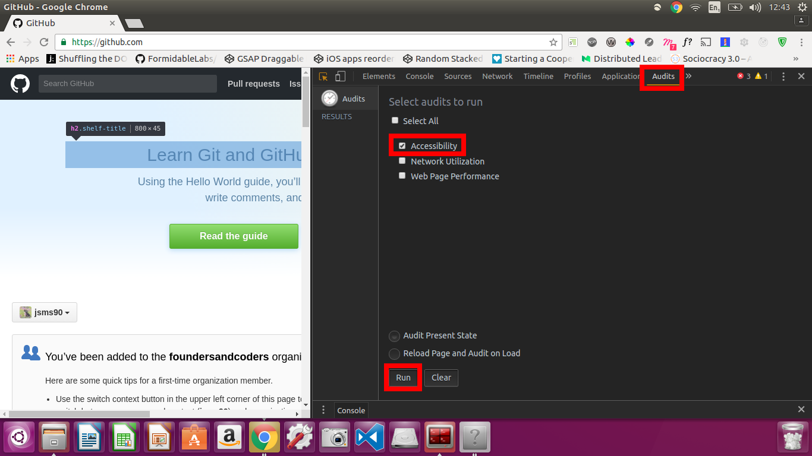

# Putting yourself in someone else's shoes

> Have you ever thought of the Internet as being "essential" or "a lifeline for many disabled people?" Think about it for a minute. There are certain things that people with disabilities simply cannot do for themselves. But, if they can use a computer connected to the world via the Internet, they have a high degree of independence. They can read the news, research areas of interest, purchase supplies, and access the world—at least potentially. They are independent as long as the sites that they want to access are designed to permit disability access.

from a WebAIM [article](http://webaim.org/articles/motor/)

+ [Stats](#some-statistics)
+ [Exercises](#exercises)
+ [Tools that can help](tools-that-can-help)
  + [What these tools check for](#what-these-tools-check-for)

## Some statistics
The following stats are taken from WHO (World Health Organisation) [research](http://www.who.int/mediacentre/factsheets/fs282/en/):

> About 90% of people with the disabilities in the list above, live in the developing world.

Even if we hear about the number of people who experience these disabilities, developers often mistakenly believe that these people aren't within their own userbase.

> 285 million people are visually impaired worldwide

That's nearly 4 times the population size of the UK and Israel combined

> 39 million of these are [blind](http://webaim.org/articles/visual/blind)

>   + 82% of blind people are over 50 years old

This age group constitutes 20% of the world, and many developing countries have an aging population

> 246 million have [low vision](http://webaim.org/articles/visual/lowvision)

> 360 million suffer from [hearing loss](http://webaim.org/articles/auditory/)

### Exercises
Think about your own website. Have you written it under the assumption that your users will be accessing your content with a mouse? Have you been relying on colour to convey meaning? Did you think about captions or transcripts for your audio content?

**Pair up with someone new, preferably someone whose website you haven't seen before.**

Open up your neighbour's website.

1. Try accessing every piece of content on the site using only your keyboard.

2. Download the [HTML 5 outliner](https://chrome.google.com/webstore/detail/html5-outliner/afoibpobokebhgfnknfndkgemglggomo?hl=en) chrome extension. Then go back to the website and click on the new icon in your toolbar.

  + Is the content semantic?
  + Screen reader users navigate the page based on the order of the elements in the DOM. Does the order look sensible?

3. Put in your earphones. Then download the [ChromeVox](https://chrome.google.com/webstore/detail/chromevox/kgejglhpjiefppelpmljglcjbhoiplfn?hl=en) chrome extension. Don't go back to your neighbour's website yet!
  + Go to [www.gov.uk](https://www.gov.uk/) and try navigating around, using only your keyboard, until you feel comfortable with the functionality of ChromeVox  
  To learn the necessary keyboard shortcuts, find ChromVox in your extensions and click on "Options"  
  
  + Click on the tab/window that contains your neighbour's website
  + Close your eyes! Then try navigating the site using only ChromeVox to help you. Can you get to all the content?  

  Note: You can disable the voice by clicking `Ctrl`, or disable ChromeVox altogether with `ctrl`+`alt`+`z` (or going to Settings -> Extensions, find ChromeVox and tick the "disable" checkbox).  

4. Try this again with someone else's website.

5. Install [Accessibility Developer Tools](https://chrome.google.com/webstore/detail/accessibility-developer-t/fpkknkljclfencbdbgkenhalefipecmb?hl=en)  
  + Run an audit on your neighbour's website:  
    1. Open dev tools (as normal)  
    2. Click on the new "Audit" tab
    3. Check the "Accessibility" box
    4. Click Run  

  
  + Use the clickable links to find out what the problems are and what can be done about them
  + Raise an issue on your neighbour's website for each newly discovered problem

Once you're finished, head to your own website and start fixing bugs! :bug:

## Tools that can help
Bare in mind this advice from Government Digital Services (GDS):
> You must not solely rely on using automated tools to check accessibility - they can only find 20% to 30% of issues.

and from WebAIM:
> No automated evaluation tool can tell you if your site is accessible, or even compliant. Human testing is always necessary because accessibility is about the human experience.

So be savvy when you use the following tools. They are no substitute for learning your craft. But using a variety of tools to test different aspects can at least help you while you're learning:

### HTML checkers
[HTML validator](https://validator.w3.org/) (website) - fairly comprehensive  
[HTML Code Sniffer](http://squizlabs.github.io/HTML_CodeSniffer/) (website)

### All in one - [see a summary of what these tools check for](#what-these-tools-check-for)
[Tenon.io](https://tenon.io/) (website) - nice visual representations, and fairly thorough  
[Wave - the chrome extension](https://chrome.google.com/webstore/detail/wave-evaluation-tool/jbbplnpkjmmeebjpijfedlgcdilocofh/related) - not as visually appealing, but does contain more thorough description that is directly related to W3C's advice, with links
[Wave - the website, in case you don't want to download yet another extension](http://wave.webaim.org/)  
[Tota11y](https://chrome.google.com/webstore/detail/tota11y-chrome-extension/jbhkjcigeionejpngkcdccblocdnjini?hl=en) (chrome extension) developed by Khan Academy  
[a11y](https://addyosmani.com/a11y/) (command line tools) - especialy useful once you're writing backend code and running scripts using your command line, you never have to leave the terminal

### The ones you will have downloaded during the workshop  
[Accessibility Developer Tools](https://chrome.google.com/webstore/detail/accessibility-developer-t/fpkknkljclfencbdbgkenhalefipecmb?hl=en) (chrome extension) - sits inside your dev tools rather than the toolbar, so easy to switch between the accessibility audits and changing your code  
[HTML 5 outliner](https://chrome.google.com/webstore/detail/html5-outliner/afoibpobokebhgfnknfndkgemglggomo?hl=en) (chrome extension) - nothing fancy, just a quick visual check of your DOM ordering & semantics  
[ChromeVox](https://chrome.google.com/webstore/detail/chromevox/kgejglhpjiefppelpmljglcjbhoiplfn?hl=en) (chrome extension) - it's good to remind yourself what it's like once in a while, a nice interactive way of seeing if your code does what you want it to  

#### What these tools check for
There are many things that these tools don't cover. Generally, they're looking at a high-level overview of the things you should be considering:
+ Provide appropriate alternative text
+ Provide appropriate document structure
+ Provide headers for data tables
+ Ensure users can complete and submit all forms
+ Ensure links make sense out of context
+ Caption and/or provide transcripts for media
+ Ensure accessibility of non-HTML content, including PDF files, Microsoft Word documents, PowerPoint presentations and Adobe Flash content
+ Allow users to skip repetitive elements on the page
+ Do not rely on color alone to convey meaning
+ Make sure content is clearly written and easy to read
+ Make JavaScript accessible e.g. your page does not rely on JavaScript to function & event handlers are device independent
+ Design to HTML5 & CSS3 standards i.e. separate content from presentation

When you first learned how to style basic elements using CSS, you had no idea how to do the huge variety of things it has to offer. Think of this in the same way. We've barely scratched the surface, but that's the fun part!
