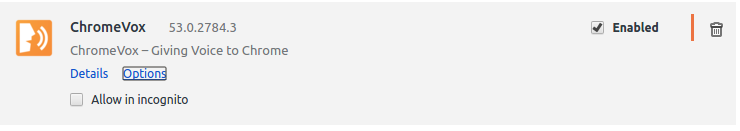
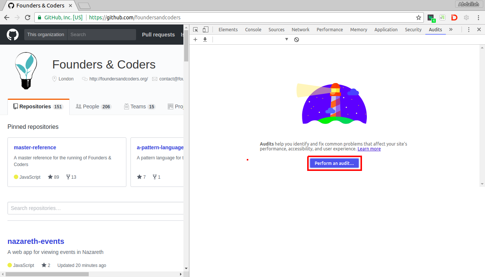
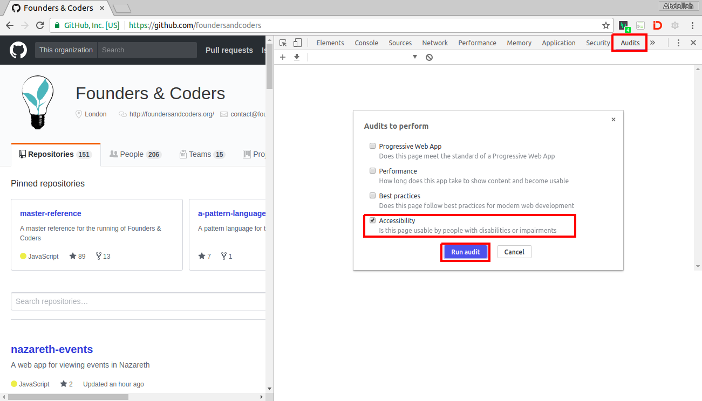

# Putting yourself in someone else's shoes

The internet is a lifeline for many disabled people it gives people with various disabilities a much higher level of independence. 

This only works as long as the sites that they want to access are designed to permit disability access.

https://www.youtube.com/watch?v=3f31oufqFSM

### Exercises
When building websites, we must be careful not to assume that everyone using it is abled bodied. your users may not be able to use a mouse, or may be visually impared. 

1. Navigate to [visitpalestine.ps](http://visitpalestine.ps/) . Try accessing the website using only your keyboard. Find the number for the H2 hostel in Hebron without using your mouse (the path = menu - where to go - hebron - hotels - H2 hostel)

2. Download the [HTML 5 outliner](https://chrome.google.com/webstore/detail/html5-outliner/afoibpobokebhgfnknfndkgemglggomo?hl=en) chrome extension. Then go back to the website and click on the new icon in your toolbar.

  + Is the content semantic?
  + Screen reader users navigate the page based on the order of the elements in the DOM. Does the order look sensible?

3. Put in your earphones. Then download the [ChromeVox](https://chrome.google.com/webstore/detail/chromevox/kgejglhpjiefppelpmljglcjbhoiplfn?hl=en) chrome extension. 
  + Go to any website of your choice and try navigating around, using only your keyboard, until you feel comfortable with the functionality of ChromeVox.
  To learn the necessary keyboard shortcuts, find ChromVox in your extensions and click on "Options"  
  
  + now when you feel comfortable go back to http://visitpalestine.ps/ and close your eyes! Then try navigating the site using only ChromeVox to help you. with your eyes closed find out how much the embroidered bottle carrier is. (path = menu - online store - apparel & accessories - embroidered bottle carrier). 

  Note: You can disable the voice by clicking `Ctrl`, or disable ChromeVox altogether with `ctrl`+`alt`+`z` (or going to Settings -> Extensions, find ChromeVox and tick the "disable" checkbox).  

4. Install [Accessibility Developer Tools](https://chrome.google.com/webstore/detail/accessibility-developer-t/fpkknkljclfencbdbgkenhalefipecmb?hl=en)  
  + Run an audit on [visitpalestine.ps](http://visitpalestine.ps/):  
    1. Open dev tools (as normal)  
    2. Click on the new "Audits" tab
    3. Click Perform an audit
    

    4. Check the "Accessibility" box
    5. Click Run audit
    

  + Use the clickable links to find out what the problems are and what can be done about them, and view failing elements to know where there problems are in the code.
  
  + do some research into why each one is a problem. 

[More tools that can help](./tools-that-can-help.md)
